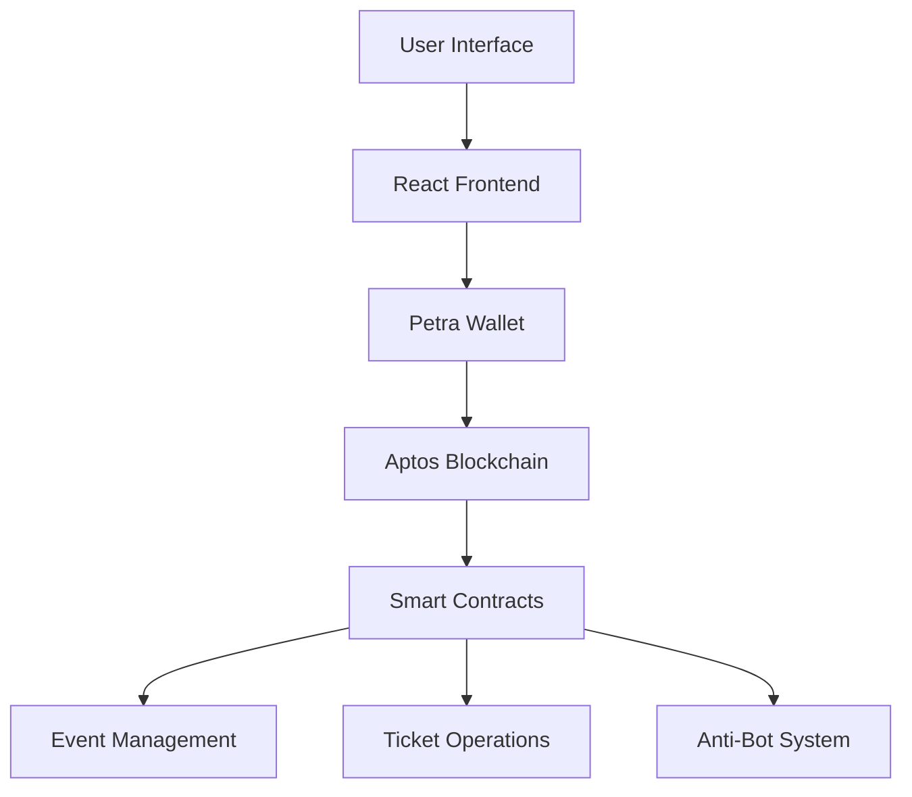
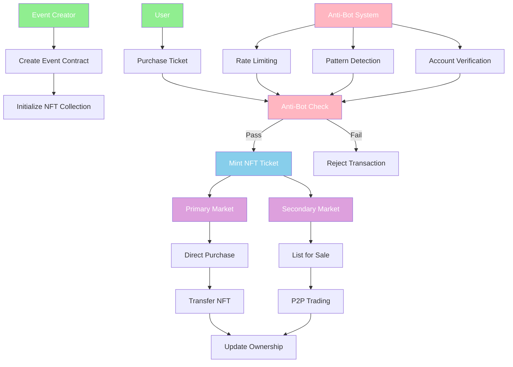

# 🎫 BlockOps - Blockchain Event Ticketing System

<div align="center">

[](https://aptos.dev/)
[](https://reactjs.org/)
[](https://move-language.github.io/)
[](https://docs.microsoft.com/en-us/windows/wsl/)

</div>

## 👥 Team Members
- Aman Gupta 
- Kunal Mittal

## 🎯 Problem Statement

Traditional event ticketing systems face numerous challenges including:
- Ticket scalping and price manipulation
- Counterfeit tickets
- Lack of transparency in secondary markets
- High transaction fees
- Limited control over resale rights

## 💡 Solution

BlockOps is a decentralized event ticketing system built on the Aptos blockchain that addresses these challenges through:
- Smart contract-based ticket management
- Decentralized ownership verification
- Transparent pricing mechanisms
- QR code-based authentication
- Anti-bot protection system
- Automated royalty distribution

## 🛠️ Tech Stack

- **Blockchain Platform**: Aptos
- **Smart Contract**: Move Language
- **Wallet Integration**: Petra
- **Frontend**: React
- **Development Environment**: Visual Studio Code with WSL

## 🎯 Key Features

### Primary Market
- Event creation and organization
- Direct ticket purchases
- QR code ticket visualization
- Event details viewing

### Secondary Market
- List tickets for sale
- Purchase from secondary market
- Operator management (grant/revoke)
- Anti-bot protection

## 💻 UI Showcase

### My Tickets Interface

Features:
- Ticket QR code display
- Event ID tracking
- Purchase timestamp
- Quantity management

### Event Creation Interface

Features:
- Event details input
- Pricing configuration
- Seat capacity management
- Royalty percentage setting

## 📁 Project Structure

```
APTOS-WEB3-APP/
├── node_modules/
├── public/
├── src/
│   ├── ActiveListings.js
│   ├── App.css
│   ├── App.js
│   ├── App.test.js
│   ├── BuyTicket.js
│   ├── CreateEvent.js
│   ├── GetEventDetails.js
│   ├── index.css
│   ├── index.js
│   ├── IntroPage.js
│   ├── ListForSale.js
│   ├── logo.svg
│   ├── MyTickets.js
│   ├── PurchaseTicket.js
│   ├── reportWebVitals.js
│   ├── setupTests.js
│   └── TicketQRCode.js
├── .env
├── .gitignore
├── package-lock.json
├── package.json
└── README.md
```

## 🚀 Installation & Setup

### Prerequisites
1. WSL2 installation on Windows
2. Visual Studio Code
3. Node.js
4. Aptos CLI
5. Petra Wallet Extension

### Development Setup

1. **WSL Configuration**
```bash
wsl --install
wsl --set-default-version 2
```

2. **Project Setup**
```bash
git clone <repository-url>
cd APTOS-WEB3-APP
npm install
```

3. **Environment Configuration**
```bash
cp .env.example .env
# Add required configuration variables
```

## 🔧 System Architecture

### System Overview


## 📝 Smart Contract Details

### Contract Functions
- Event creation and management
- Ticket minting and distribution
- Secondary market operations
- Anti-bot protection mechanisms
- Royalty distribution system

## 🏃‍♂️ Running Locally

1. **Start Development Server**
```bash
npm start
```

2. **Access Application**
- Open http://localhost:3000
- Connect Petra wallet
- Start interacting with the dApp

## 🔐 Security Features

1. **Anti-Bot Protection**
- Transaction pattern analysis
- Rate limiting
- Behavioral verification

2. **Ticket Validation**
- QR code verification
- Blockchain validation
- Timestamp verification

## 🌐 Deployment

1. **Smart Contract Deployment**
```bash
cd event_ticketing
aptos move compile
aptos move publish
```

2. **Frontend Deployment**
```bash
npm run build
# Deploy build directory to hosting service
```

### Blockchain Flow and NFT Setup

## 🔄 Marketplace Flow

1. **Primary Market**
- Event creator deploys contract
- Sets ticket parameters
- Users purchase directly

2. **Secondary Market**
- Ticket holders list for sale
- Buyers purchase from holders
- Automatic royalty distribution

## 🛡️ Anti-Bot Protection

1. **Prevention Mechanisms**
- Purchase rate limiting
- Account age verification
- Transaction complexity analysis

2. **Detection Systems**
- Pattern recognition
- Behavioral analysis
- Automated flagging

## 🤝 Contributing

1. Fork the Project
2. Create your Feature Branch
3. Commit your Changes
4. Push to the Branch
5. Open a Pull Request

## 📞 Contact

Project Link: [https://github.com/your-username/BlockOps](https://github.com/your-username/BlockOps)

---
<div align="center">
<p>Made with ❤️ by BlockOps Team</p>

<a href="https://github.com/your-username/BlockOps/stargazers">
    
</a>
</div>
